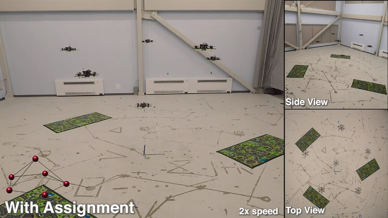

ACL Swarm
=========

ROS implementation of a formation flying pipeline with distributed motion planning, decentralized task assignment, and onboard localization.

## Video

<p align="center">
    <a href="https://www.youtube.com/watch?v=il0UJCyiAzY"></a>
</p>

## Getting Started

The `aclswarm` pipeline leverages ROS and the MIT ACL [custom autopilot stack](https://gitlab.com/mit-acl/fsw/snap-stack). This stack targets the [Qualcomm Snapdragon Flight](https://developer.qualcomm.com/hardware/qualcomm-flight-pro) and supports software-in-the-loop (SIL) simulation.

This software has been tested with ROS Indigo, Kinetic and Melodic. We assume your preferred flavors of Ubuntu/ROS have already been [installed](http://wiki.ros.org/ROS/Installation).

### Simulation

To get started, create a new workspace and use [wstool](http://wiki.ros.org/wstool) to setup the necessary dependencies.

```bash
$ mkdir -p aclswarm_ws/src && cd aclswarm_ws/src
$ catkin init && catkin config --extend /opt/ros/melodic # or whatever
$ git clone https://github.com/mit-acl/aclswarm
$ wstool init
$ wstool merge ./aclswarm/.simulation.rosinstall.https
$ wstool up -j8
```

Then, build and source your workspace as usual

```bash
$ catkin build
$ source ../devel/setup.bash
```

To run a simulation (referred to as a *trial*) use the following incantation. **There must not be a `roscore` running** before you run this step.

```bash
$ rosrun aclswarm_sim trials.sh -f swarm6_3d -i
```

This will spin up a simulation and open an `rviz` window and an `rqt_gui` window. Wait for the following message in the terminal (depending on your machine you may need to wait a few seconds after this message for good measure):

```bash
Simulation initialized. You may now press 'START'.
Once rqt_gui (7260) is quit, simulation will clean up.
```

Follow the instructions in the **Operation** section below. Note that exiting the `rqt_gui` window will quit the entire simulation.

### Hardware

### Operation

To run an experiment, follow this sequence:

1. Arm each of the vehicles. *In simulation the vehicles are armed by default.*
2. Press **START** in the `rqt_gui` window and the vehicles will take off to their `takeoff_alt`.
3. Each subsequent click of the **START** button causes the swarm to cycle through the formations defined in the formation group (e.g., `swarm6_3d`).
4. Press **END** to gracefully land the vehicles in their current x-y position.
5. Press **E-STOP** to emergency stop, which immediately kills the motors.

